# My Clinic Kids

ระบบจองคิวและติดตามพัฒนาการสำหรับคลินิกกิจกรรมบำบัดเด็ก
ผู้ปกครองใช้งานผ่าน LINE · เจ้าหน้าที่ใช้แผงควบคุมบนเว็บที่ยืนยันตัวตนด้วย Cognito และบังคับ MFA

สถาปัตยกรรมแบบ serverless บน AWS ภูมิภาค **ap-southeast-7 (กรุงเทพฯ)** เพื่อให้ข้อมูลส่วนบุคคลอยู่ในประเทศ

<p align="center">
  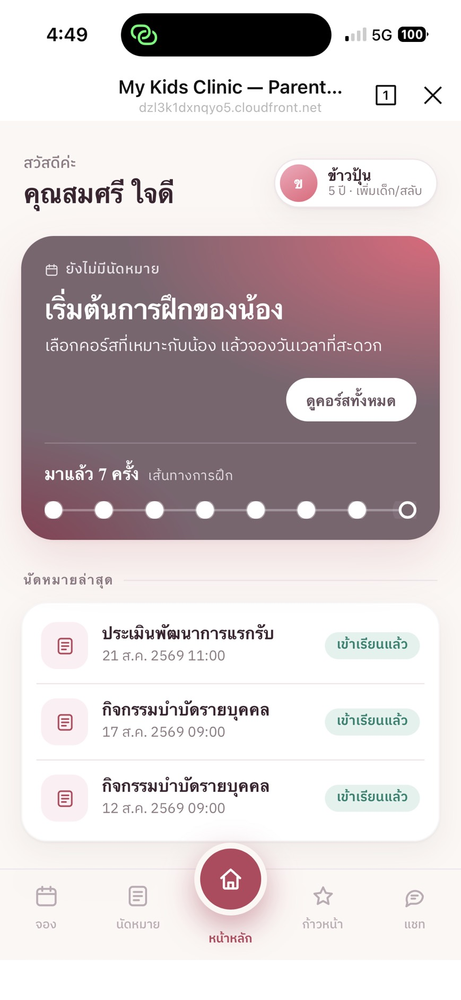
  &nbsp;&nbsp;
  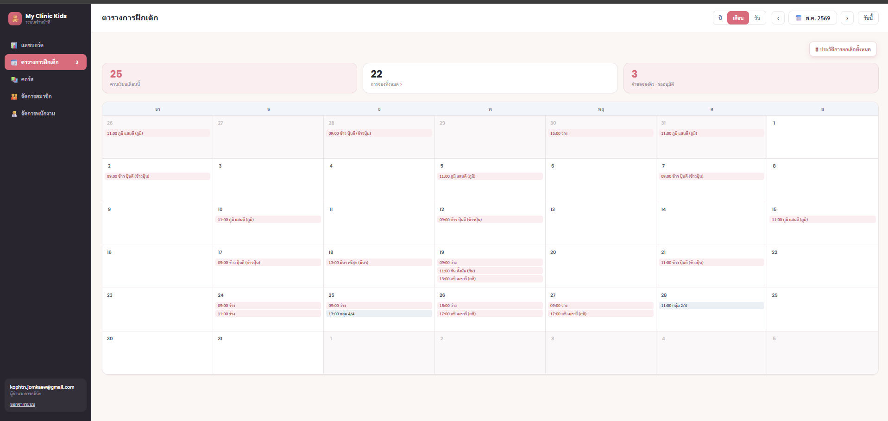
</p>

---

## ภาพรวม

| | |
|---|---|
| **โค้ดที่เขียนเอง** | ~8,860 บรรทัด — Lambda 3,060 · LINE LIFF 2,454 · แผงเจ้าหน้าที่ 3,276 |
| **ประมวลผล** | Lambda 13 ฟังก์ชัน (Node.js) |
| **API** | 26 เส้นทางบน API Gateway HTTP API · authorizer 2 ชนิด · ไม่มีเส้นทางที่เปิดโล่ง |
| **ฐานข้อมูล** | PostgreSQL 18.3 — 8 ตาราง · 53 constraints · 13 indexes |
| **Migration** | ไฟล์ SQL 4 ตัว · สองตัวที่ไปแก้ constraint เดิมมีสคริปต์ rollback คู่กัน |
| **ตัวตน** | LINE (ผู้ปกครอง) · Amazon Cognito บังคับ MFA (เจ้าหน้าที่) |
| **สิทธิ์การเข้าถึง** | 4 บทบาทใน `cognito:groups` · ปฏิเสธเป็นค่าตั้งต้น |
| **ค่าใช้จ่ายจริง** | ~$34/เดือนก่อนปลดระวาง · 95% มาจาก RDS กับ VPC endpoint ตัวเดียว |

สถานะ: ทำครบตามขอบเขตที่ตั้งไว้ รันได้จริงพร้อมข้อมูลเดโม 8 เคส ไม่เคยมีข้อมูลผู้ป่วยจริงเข้าระบบ ตอนนี้ปลดระวางชั้นฐานข้อมูลออกไปแล้ว เก็บไว้เป็น RDS snapshot — รายละเอียดอยู่ในหัวข้อสถานะโปรเจกต์ท้ายไฟล์

---

## ทำไมถึงสร้าง และทำไมถึงหยุด

เริ่มจากอยากได้แลบ AWS ที่ใหญ่พอจะบังคับให้ผมตัดสินใจเรื่องจริง — วาง VPC ยังไง จัดการตัวตนยังไง เดือนหนึ่งจ่ายเท่าไหร่ ไม่ใช่ stack ตามบทเรียนที่รันจบแล้วลบทิ้ง

โจทย์มาจากไอเดียผม คือพาร์เนอร์ผมเข้าทำงานเป็นนักกิจกรรมบำบัดที่คลินิกเด็กที่เปิดใหม่ ผมเลยคิดว่าถ้าทำโปรเเกรมจองคิวผ่านทางไลน์ที่ลูกค้าส่วนใหญ่น่าจะสะดวกถ้าเปิดไลน์
แอดไลน์ของทาง Clinic Officals ก็สามารถเข้าถึงระบบจองคิวได้ ผมจึงเริ่มทำโปรเจคนี้เพื่อฝึดสกิล AWS โดยการทำโปรเจคจริงๆ

พอระบบใช้งานได้จริง ผมติดต่อไปเสนอกับคลินิก **แล้วคำตอบที่ได้กลับมาคือจุดที่ทำให้โปรเจคนี้ไม่ได้ไปต่อ** — ทางคลินิกเขาติดต่อมาว่า คอร์สของคลินิกล็อกกิจกรรมฝึกเด็กแบบตายตัวระบบการจองออนไลน์ไม่ได้ตอบโจทย์ การให้ผู้ปกครองจองเลือกคอร์สเองทำไม่ได้ โปรเจคนี้จึงสิ้นสุดลง

จริงๆโปรเจค การจองคิวผ่านไลน์ยังสามารถ นำไปใช้ได้ในหลายธุรกิจ ถ้าจะเหมาะจริงๆน่าจะเป็นธุรกิจคลินิกทันตกรรม หรือร้านอาหาร สามารถต่อยอดโปรเจคนี้ได้

ระบบนี้กินค่ารันเดือนละราว 1,100 บาท ผมจึงคิดว่าผมอิ่มตัวกับโปรเจคนี้แล้ว และต้องการไปต่อยอดการเตรียมสอบ Certificate AWS ต่อ

การได้ทำโปรเจคนี้ทำให้ผมสนุกไปกับการพัฒนาจริงๆ ถึงจะไม่สามารถทำรายได้จากมันได้ แต่อนาคตความรู้ที่ได้จากการทำโปรเจคนี้ จะเอาไปต่อกับภาคธุรกิจอื่นๆ น่าจะหาโอกาสทำรายได้เพิ่มได้

### วิธีที่ใช้สร้าง

โค้ดส่วนใหญ่ในโปรเจกต์นี้เขียนด้วย AI ส่วนผมทำหน้าที่คุมงาน — วางสถาปัตยกรรม แบ่งงานออกเป็นชิ้นๆ เอาผลแต่ละชิ้นไปตรวจกับระบบจริง แล้วทิ้งอันที่ตรวจไม่ผ่าน ผมไม่ขอเคลมว่าเข้าใจโค้ดทุกบรรทัด

สิ่งที่ผมเคลมได้คือวินัยการตรวจสอบรอบๆ ตัวโค้ด **ตัวเลขทุกตัวใน README นี้วัดจากระบบจริงทั้งหมด** — จำนวนบรรทัด จำนวน route นิยาม constraint ค่าใช้จ่าย กลุ่มสิทธิ์ ไม่มีตัวไหนที่จำมาหรือกะเอา

หัวข้อ "ปัญหาที่รู้อยู่" ก็มาจากกระบวนการเดียวกัน ทุกข้อในนั้นเจอจากการเอาระบบจริงไปเทียบกับสิ่งที่เอกสารบอกไว้ และหลายข้อขัดกับสิ่งที่ผมเชื่อมาตลอดว่าจริง

---

## สถาปัตยกรรม

<p align="center">
  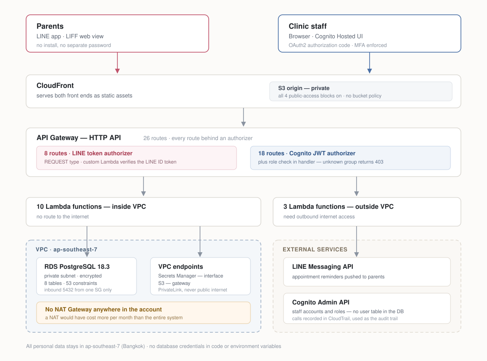
</p>

### การตัดสินใจที่ต้องอธิบายได้

**ไม่ใช้ NAT Gateway**

NAT Gateway ราคาราว $32/เดือน แพงกว่าทั้งระบบรวมกัน ผมเลยวาง Lambda 10 ตัวที่ต้องแตะฐานข้อมูลไว้ใน VPC ที่ไม่มีทางออกอินเทอร์เน็ตเลย แล้วให้คุยกับ Secrets Manager ผ่าน PrivateLink interface endpoint แทน ส่วนอีก 3 ตัวที่จำเป็นต้องยิงออกเน็ตจริงๆ (LINE Messaging, Cognito Admin) ย้ายออกไปอยู่นอก VPC ทั้งหมด

**ไม่มีความลับในโค้ดหรือ environment variable**

ทุกฟังก์ชันดึงข้อมูลรับรองจาก Secrets Manager ตอนรัน ไม่มีรหัสผ่านฐานข้อมูลใน `process.env` สักตัว และไม่มีใน repository นี้

**audit ฝั่งจัดการเจ้าหน้าที่ใช้ CloudTrail ไม่ใช่ตารางในฐานข้อมูล**

ฟังก์ชันที่จัดการบัญชีเจ้าหน้าที่อยู่นอก VPC จึงเขียนลง RDS ไม่ได้ ทางเลือกคือเพิ่ม NAT Gateway เพื่อให้ audit ทางเดียวทำงานได้ ซึ่งไม่คุ้มเลย ผมเลยอาศัยข้อเท็จจริงที่ว่า Cognito Admin API ถูกบันทึกลง CloudTrail อยู่แล้วโดยไม่ต้องทำอะไรเพิ่ม แล้วยืนยันด้วยการไล่ดูว่า `AdminListGroupsForUser` โผล่ใน event history จริง

**การกันจองซ้ำอยู่ที่ฐานข้อมูล ไม่ใช่ที่หน้าจอ**

ปุ่มจองปิดตัวเองฝั่ง client ก็จริง แต่หลักประกันตัวจริงคือ partial unique index

```sql
CREATE UNIQUE INDEX uniq_child_per_session
  ON bookings (child_id, session_id)
  WHERE status IS DISTINCT FROM 'cancelled';
```

พอชนกันจะได้ `23505` ซึ่งโค้ดแปลงต่อเป็น `409 ALREADY_BOOKED` เหตุผลที่ไม่เช็คด้วย `SELECT` ก่อน `INSERT` เพราะระหว่างสองคำสั่งนั้นมีช่องว่างให้คนอื่นแทรกเข้ามาได้เสมอ แต่ constraint ไม่มีช่องนั้น

**การกันนักบำบัดคาบชนใช้ exclusion constraint**

เพื่อให้ปฏิเสธช่วงเวลาที่ทับซ้อนกัน ไม่ใช่แค่กรณีที่เวลาเริ่มตรงกันเป๊ะ

```sql
EXCLUDE USING gist (
  therapist_id WITH =,
  tstzrange(starts_at, ends_at) WITH &&
) WHERE (status <> 'cancelled')
```

**บันทึกทางคลินิกถูกแยกตั้งแต่ระดับ schema**

ตาราง `session_notes` มีสองคอลัมน์ — `clinical_note` ที่ไม่เคยออกจากแผงเจ้าหน้าที่ กับ `parent_summary` ที่แอปผู้ปกครองเอาไปแสดง เจ้าหน้าที่กรอกทั้งสองช่องในฟอร์มเดียว แต่ฝั่งผู้ปกครองไม่มีเส้นทาง API ไหนเลยที่คืนค่าช่องคลินิกออกมาได้

**ไม่มีการลบถาวรในการใช้งานปกติ**

ข้อมูลเด็ก คอร์ส บัญชีเจ้าหน้าที่ และคาบที่ยกเลิก ทั้งหมดย้ายเข้าแฟ้มจัดเก็บและกู้กลับได้ ปุ่มลบถาวรมีอยู่ที่เดียวคือในหน้าแฟ้มจัดเก็บ

---

## ความปลอดภัย

- RDS ไม่มี public endpoint · security group อนุญาตพอร์ต 5432 **จาก security group ต้นทางตัวเดียวเท่านั้น** ไม่เปิดให้ CIDR ไหนเลย แม้แต่ของ VPC ตัวเอง
- เปิดการเข้ารหัสข้อมูลที่จัดเก็บ · automated backup 7 วัน · ถ่าย manual snapshot ก่อนทุก migration
- S3 ต้นทางเปิด public access block ครบทั้ง 4 ชั้น และไม่มี bucket policy เข้าถึงได้ทางเดียวคือผ่าน CloudFront
- Cognito บังคับ MFA ทุกบัญชี · รหัสผ่านขั้นต่ำ 8 ตัวครบทั้ง 4 ประเภทอักขระ · รหัสชั่วคราวหมดอายุใน 7 วัน · การกู้บัญชีมี 2 ขั้น
- ระบบไม่เคยจับรหัสผ่านเจ้าหน้าที่เอง ใช้ OAuth2 authorization code flow ผ่าน Cognito Hosted UI
- การตรวจ role เป็นแบบปฏิเสธไว้ก่อน token ที่ไม่มีกลุ่มที่โค้ดรู้จักจะได้ `403` ไม่ใช่สิทธิ์ขั้นต่ำ

ปัญหาที่เจอและแก้ระหว่างการตรวจครั้งสุดท้าย เขียนแยกไว้ที่ [`docs/security-findings.md`](docs/security-findings.md)

---

## ระบบทำอะไรได้

### ฝั่งผู้ปกครอง — LINE LIFF

| | |
|---|---|
| 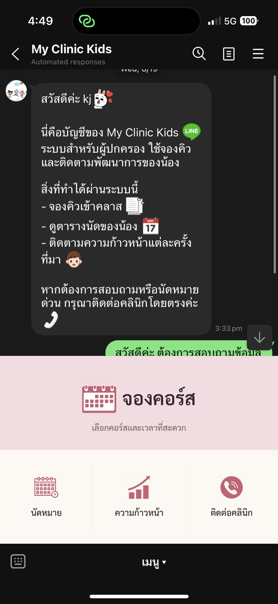 | **LINE official account พร้อม rich menu** — เปิดใช้ในไลน์ได้เลย ไม่ต้องติดตั้งอะไร ไม่ต้องจำรหัสผ่านเพิ่มอีกชุด |
| 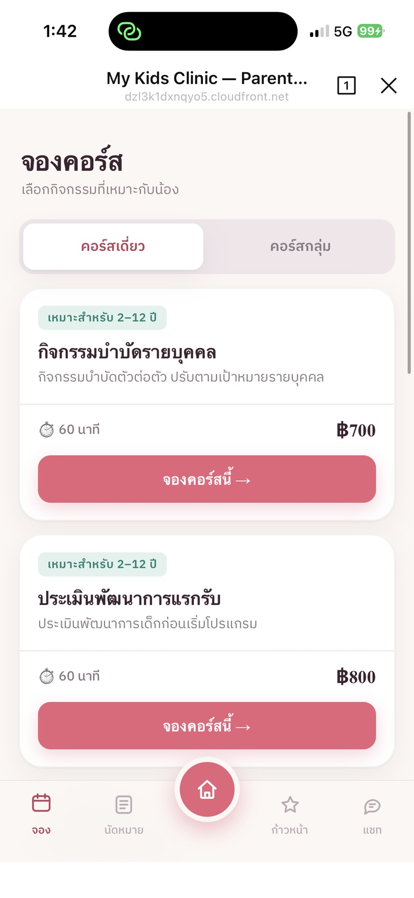 | **คอร์สเดี่ยวจองเองได้ทันที** — เลือกคอร์ส เลือกเวลา จบ |
| 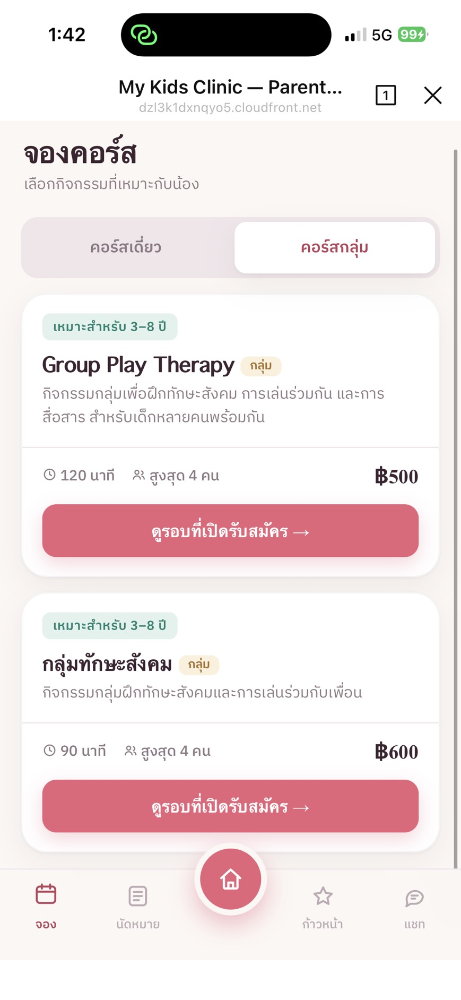 | **คอร์สกลุ่มส่งต่อเข้าแชท** — การจัดกลุ่มต้องดูช่วงวัยและระดับทักษะประกอบกัน ซึ่งเป็นดุลยพินิจของนักบำบัด ปุ่มตรงนี้จึงเป็น "ดูรอบที่เปิดรับสมัคร" ไม่ใช่ปุ่มจอง |
| 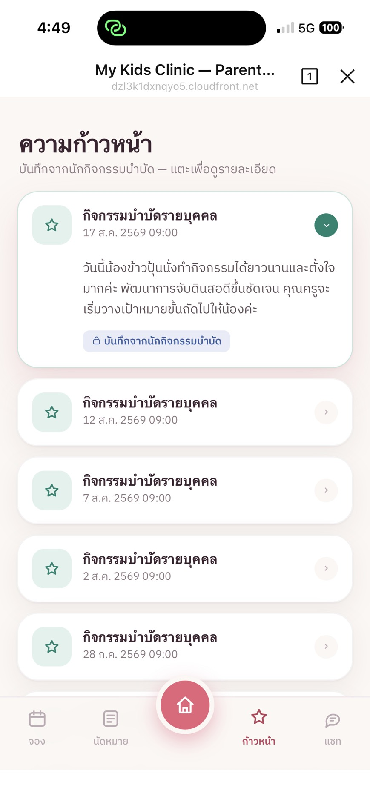 | **บันทึกพัฒนาการหลังเข้าฝึกทุกครั้ง** เขียนโดยนักกิจกรรมบำบัด ผู้ปกครองเห็นเฉพาะส่วนที่สรุปมาให้ผู้ปกครองอ่าน |
| 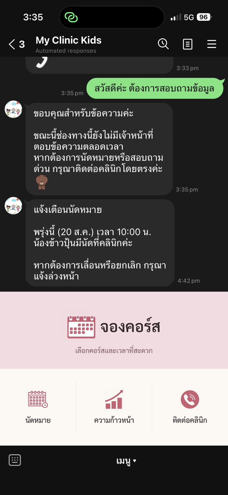 | **แจ้งเตือนนัดหมาย** ส่งเป็น push message ทาง LINE |

### ฝั่งเจ้าหน้าที่ — แผงควบคุมบนเว็บ

| | |
|---|---|
|  | **ตารางแบบ ปี / เดือน / วัน** พร้อมตัวนับคาบเรียน การจอง และคำขอที่ยังรออนุมัติ |
| 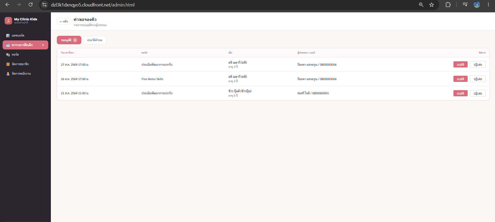 | **คำขอจองต้องผ่านการอนุมัติก่อน** ถึงจะกลายเป็นคาบที่ยืนยันแล้ว |
| 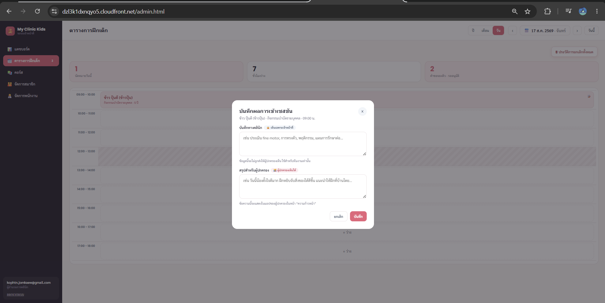 | **ฟอร์มบันทึกแยกช่องคลินิกกับช่องผู้ปกครอง** มีป้ายกำกับในหน้าจอให้เห็นความต่างตั้งแต่ตอนพิมพ์ |
| 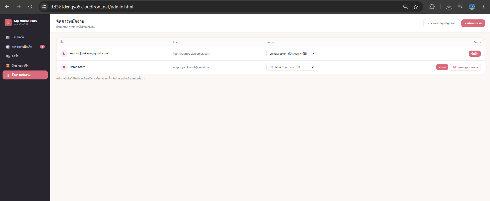 | **จัดการบัญชีและบทบาทเจ้าหน้าที่** ผ่าน Cognito Admin API ไม่มีตารางผู้ใช้ในฐานข้อมูลเลย |

คลิปสั้นของสองงานที่ต้องใช้ทั้งสองแอปร่วมกัน — ผู้ปกครองจองแล้วเจ้าหน้าที่กดอนุมัติ และเจ้าหน้าที่เขียนบันทึกแล้วไปโผล่ในแอปผู้ปกครอง — อยู่ใน [`media/`](media/)

---

## เทคโนโลยีที่เลือกและเหตุผล

| ชั้น | เลือกอะไร | เพราะอะไร |
|---|---|---|
| แอปผู้ปกครอง | LINE LIFF | ผู้ปกครองทุกคนมี LINE อยู่แล้ว ปัญหาเรื่องติดตั้งแอปกับลืมรหัสผ่านหายไปทั้งหมด |
| แผงเจ้าหน้าที่ | HTML/CSS/JS แบบ static บน CloudFront | ไม่มีขั้นตอน build ไม่มีเฟรมเวิร์กให้ตามอัปเดต ค่าโฮสต์เกือบเป็นศูนย์ |
| API | API Gateway HTTP API | ถูกกว่าและง่ายกว่า REST API แถมรองรับ JWT authorizer มาในตัว |
| ประมวลผล | Lambda (Node.js) | ทราฟฟิกวันละไม่กี่ครั้ง จ่ายค่าเซิร์ฟเวอร์ที่นั่งว่างทั้งวันไม่สมเหตุสมผล |
| ฐานข้อมูล | RDS PostgreSQL | exclusion constraint กับ partial index จัดการเรื่องแย่งกันเขียนได้ในจุดที่โค้ดฝั่งแอปมักทำพลาด |
| ความลับ | Secrets Manager ผ่าน PrivateLink | ข้อมูลรับรองไม่อยู่ในโค้ด และไม่ต้องวิ่งออกอินเทอร์เน็ตสาธารณะ |
| ตัวตนเจ้าหน้าที่ | Cognito + Hosted UI | ได้ MFA นโยบายรหัสผ่าน และการกู้บัญชีมาเลย โดยไม่ต้องเขียนระบบ auth เอง |

---

## ปัญหาที่รู้อยู่

รายการตามจริงทั้งหมด ทุกข้อยืนยันด้วยการวัด ไม่ใช่การเดา

| ปัญหา | ผลกระทบ |
|---|---|
| Cognito มี 4 กลุ่ม แต่โค้ดรู้จักแค่ `ClinicDirector` กับ `Admin` | บัญชีที่เป็น `OT` หรือ `SpecialEd` ล็อกอินผ่าน แต่โดนปฏิเสธทุกเส้นทาง ทั้งที่ dropdown ในหน้าจอมีให้เลือกครบทั้งสี่ |
| ฟอร์มบันทึกพัฒนาการไม่ดึงค่าเดิมมาแสดง | กด "ดู/แก้" แล้วได้ฟอร์มเปล่าทั้งที่มีบันทึกอยู่ ข้อมูลเดิมยังอยู่ครบและแสดงในแอปผู้ปกครองได้ปกติ |
| migration ที่จะเพิ่ม `UNIQUE (booking_id)` ให้ `session_notes` ไม่เคยถูกรัน | ตอนนี้ยังไม่มีอะไรกันไม่ให้ booking เดียวมีบันทึกหลายอัน |
| exclusion constraint คืน SQLSTATE `23P01` ไม่ใช่ `23505` | โค้ดที่ดักเฉพาะ `23505` จะคืน `500` แทนที่จะเป็น `409` ในเส้นทางสร้างคาบฝั่งแอดมิน ยังไม่ได้ไล่ดูในโค้ดว่าเกิดจริงหรือไม่ |
| `notification_log` ไม่เคยถูกเขียนเลยสักครั้ง | ตัวส่งการแจ้งเตือนไม่มีไดรเวอร์ฐานข้อมูล ตารางมีอยู่แต่ว่างเปล่า |
| ชื่อทรัพยากรไม่ตรงกัน เพราะเปลี่ยนชื่อโปรเจกต์กลางทาง | instance ชื่อ `mck-db` · secret ชื่อ `babyplaytime/db-credentials` · ฐานข้อมูลชื่อ `babyplaytime` การไล่เปลี่ยนให้ตรงต้อง deploy ใหม่ 12 ฟังก์ชัน จึงเลือกเขียนเอกสารกำกับไว้แทน |
| หน้าแดชบอร์ดเป็น placeholder | วางขอบเขตไว้แล้วแต่ยังไม่ได้ลงมือทำ |
| log เก็บ 14 วัน และไม่ได้สร้าง CloudTrail trail | event history ครอบคลุมย้อนหลัง 90 วัน พอสำหรับเดโม แต่ไม่พอถ้าจะใช้งานจริง |

---

## สถานะโปรเจกต์

หยุดหลังทำครบตามขอบเขตที่ตั้งไว้ ด้วยเหตุผลที่เขียนไว้ข้างบน

เพื่อหยุดค่าใช้จ่าย อินสแตนซ์ RDS และ VPC endpoint ของ Secrets Manager ถูกลบไป ฐานข้อมูลเก็บไว้เป็น snapshot แบบ manual 5 ชุด รวมถึงชุดที่ถ่ายไว้ก่อนลบทันที ส่วน Lambda, API Gateway และ Cognito แทบไม่มีค่าใช้จ่ายและยัง deploy อยู่

แผงควบคุมเจ้าหน้าที่เสิร์ฟผ่าน CloudFront และยังเปิดดูได้แม้ฐานข้อมูลถูกถอดออกไปแล้ว จนกระทั่งปิดไปเมื่อ 10 กันยายน 2569 — เมื่อไม่มีระบบหลังบ้านรองรับ หน้าแอดมินที่เข้าถึงได้จากอินเทอร์เน็ตสาธารณะคือความเสี่ยงที่ไม่มีข้อดีใดตอบแทน เลือก disable ไม่ใช่ delete ดังนั้น origin บน S3 และโดเมนเดิมยังอยู่ครบ เปิดกลับได้ในคลิกเดียว การกู้ระบบทั้งหมดคือ restore snapshot แล้วสร้าง VPC endpoint ใหม่หนึ่งตัว
---

## โครงสร้าง repository

```
lambda/       13 ฟังก์ชัน แยกโฟลเดอร์ละตัว
liff/         แอปฝั่งผู้ปกครองบน LINE
admin/        แผงควบคุมเจ้าหน้าที่
migrations/   migration 4 ตัว + rollback 2 ตัว
docs/         สถาปัตยกรรม การตัดสินใจ ผลตรวจความปลอดภัย
media/        ภาพหน้าจอและคลิป
```
